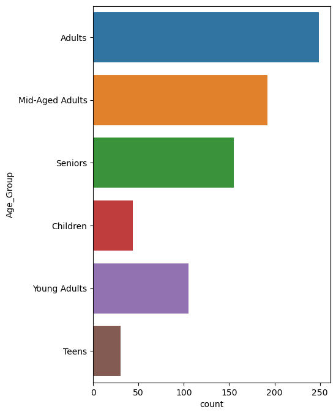
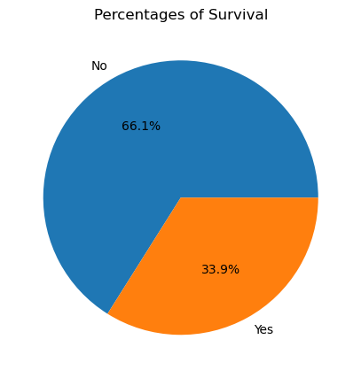
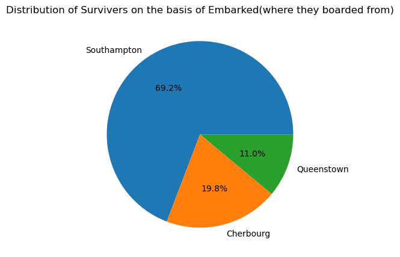
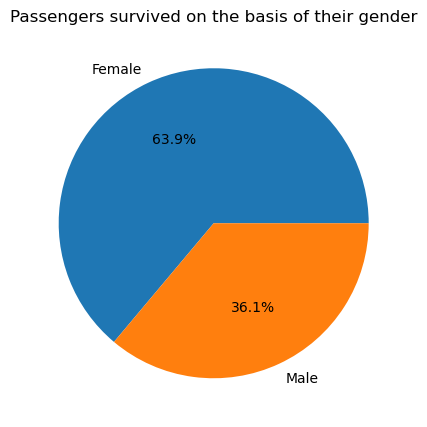
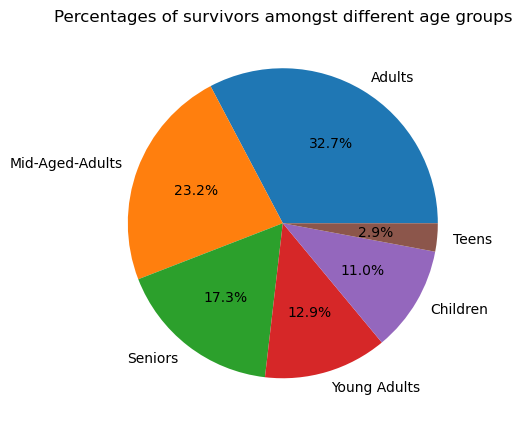

# Titanic Data Analysis

## Overview
The Titanic Data Analysis project explores the factors influencing survival on the Titanic using various data analysis techniques.

## Analysis
The analysis covers different aspects of the dataset, looking into passenger demographics, ticket prices, and survival rates.

## Conclusion
We seek to conclude insights on how various factors impacted survival rates during the tragedy of the Titanic.

