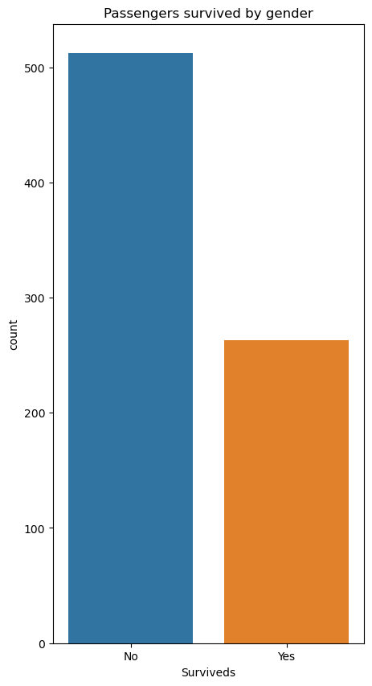

# Titanic Survival Prediction | End-to-End ML Analysis


[](https://colab.research.google.com/github/MurtazaMajid/Titanic-Data-Analysis/blob/main/notebooks/titanic.ipynb)

---

## Project Motivation

Predicting Titanic passenger survival is a classic ML problem, perfect for demonstrating:

- Data cleaning and preprocessing  
- Feature engineering  
- Exploratory Data Analysis (EDA)  
- Logistic Regression modeling  
- Model evaluation  

This repo provides a **complete end-to-end workflow**, from raw data to actionable insights.

---

## Problem Statement

Given passenger information such as age, gender, passenger class, family size, fare, and embarkation point, predict if the passenger survived the Titanic disaster.

---

## Dataset

**Source:** [Kaggle Titanic Dataset](https://www.kaggle.com/c/titanic/data)  
**Total Passengers:** 891  

| Feature         | Description                           |
|-----------------|---------------------------------------|
| PassengerId     | Unique identifier                     |
| Pclass          | Passenger class (1st, 2nd, 3rd)      |
| Name            | Passenger name                        |
| Sex             | Gender                                |
| Age             | Passenger age                         |
| SibSp           | Siblings/Spouses aboard               |
| Parch           | Parents/Children aboard               |
| Ticket          | Ticket number                         |
| Fare            | Ticket fare                           |
| Cabin           | Cabin number                           |
| Embarked        | Port of embarkation                   |
| Survived        | Target variable (0 = No, 1 = Yes)    |

---

## Workflow

1. Load dataset  
2. Remove irrelevant columns (`Name`, `Ticket`, `Cabin`)  
3. Handle missing values (`Age`) via interpolation  
4. Remove Fare outliers (IQR method)  
5. Encode categorical variables (`Sex`)  
6. Create new features (`Age Groups`, `Family Size`)  
7. Exploratory Data Analysis & visualization  
8. Train Logistic Regression model  
9. Evaluate performance (accuracy, confusion matrix, classification report)  

---

## Exploratory Data Analysis

### Fare Distribution
  
- Outliers removed using IQR method.  
- Helps normalize Fare and improve model performance.

### Survival by Gender
  
- Females: 68.9% survival vs Males: 17.9%.  
- Confirms “women and children first.”

### Age Distribution
  
- Children had highest survival rate, teens the lowest.  
- Most passengers aged 20–40.

### Survival by Passenger Class
  
- 1st and 2nd class passengers survived more than 3rd class.  
- Social class was a major survival factor.

### Feature Correlation
  
- `Pclass` negatively correlated with survival  
- `Fare` positively correlated  
- `Age` slightly negatively correlated  

### Model Performance
  
- Logistic Regression accuracy: 76%  
- Model captures key patterns using minimal features.

---

## Machine Learning Model | Logistic Regression

**Features Used:** Age, Pclass, Sex  

```python
from sklearn.model_selection import train_test_split
from sklearn.preprocessing import StandardScaler
from sklearn.linear_model import LogisticRegression
from sklearn.metrics import accuracy_score, confusion_matrix, classification_report

# Split data
X_train, X_test, y_train, y_test = train_test_split(X, y, test_size=0.3, random_state=42)

# Scale features
scaler = StandardScaler()
X_train = scaler.fit_transform(X_train)
X_test = scaler.transform(X_test)

# Train model
model = LogisticRegression()
model.fit(X_train, y_train)

# Predict
y_pred = model.predict(X_test)

# Evaluation
accuracy = accuracy_score(y_test, y_pred)
print(f"Accuracy: {accuracy:.2f}")
print(confusion_matrix(y_test, y_pred))
print(classification_report(y_test, y_pred))
```

**Performance Summary:**

| Metric       | Score |
|-------------|-------|
| Accuracy     | 0.76  |
| Precision 0 | 0.80  |
| Recall 0    | 0.85  |
| Precision 1 | 0.68  |
| Recall 1    | 0.61  |

---

## Example Prediction

| Age | Sex | Pclass | Prediction | Probability |
|-----|-----|--------|-----------|------------|
| 21  | Male| 1      | Survived  | 58.5%      |

---

## Key Insights

- Women and children had the highest survival  
- Higher class = higher survival  
- Family size 3 had best survival  
- Cherbourg embarkation passengers survived more often  
- Age, gender, and class were the most predictive features  

---

## Repository Structure

```
Titanic-Data-Analysis
├── notebooks/           # Jupyter notebook
├── data/                # Cleaned CSV
├── images/              # Plots and visualizations
├── requirements.txt     # Python dependencies
└── README.md
```

---

## Installation

```bash
git clone https://github.com/MurtazaMajid/Titanic-Data-Analysis.git
cd Titanic-Data-Analysis
pip install -r requirements.txt
jupyter notebook notebooks/titanic.ipynb
```

---

## Skills & Tech Stack

Python | Pandas | NumPy | Matplotlib | Seaborn | Scikit-learn | EDA | Feature Engineering | Logistic Regression | Model Evaluation  

---

## Future Improvements

- Include features like passenger titles and cabin info  
- Test advanced models: Random Forest, XGBoost, SVM  
- Hyperparameter tuning and cross-validation  
- Deploy as a web application (Flask or Streamlit)  

---

## Author

**Murtaza Majid**  
GitHub: [@MurtazaMajid](https://github.com/MurtazaMajid)  
LinkedIn: Murtaza Majid
